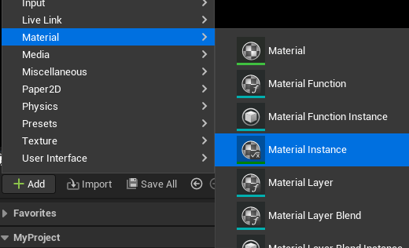

# Scale Shape User Guide

## Introduction

[Scale Shape](https://www.unrealengine.com/marketplace/slug/0583bee0862b443d949b91bcf32a2918) is a plugin for the Unreal Engine that allows you to generate Signed Distance Fields [Shape](https://iquilezles.org/articles/distfunctions2d/) using in Widget.

## Usage

* To start using this plugin, first enable it in the editor.

    

* Then, within the Palette of any Widget Blueprint Editor, search for "Scale Shape." All supported widgets will be listed there. To access the relevant parameters, search for "Scale Shape" in the Details panel. Each parameter has been annotated, allowing you to easily understand what they represent at any time.

    

* Additionally, this plugin includes a material that can be used to render pre-generated [MSDF](https://github.com/Chlumsky/msdfgen) (Multi-channel Signed Distance Field) bitmaps. Here is how to use it:

    1. Generate the desired MSDF bitmap using [msdfgen]([http](https://github.com/Chlumsky/msdfgen)) with svg
  
          `msdfgen -pxrange {size} -scale {size/svg_size} -svg {svg_file} -o {out_path} -size {size} {size}`
  
          `size`: Represents the size of the output image although it supports different width and height values here I use the same value.
  
          `svg_size`: Represents the size of svg shape width and height.
  
          `svg_file`: Denotes the path or filename of the SVG file.
  
          `out_path`: Represents the path or directory where the generated MSDF file will be saved.
    2. In the Unreal Editor, create a material instance and set the Parent Material to M_MSDF.
    
        

        
