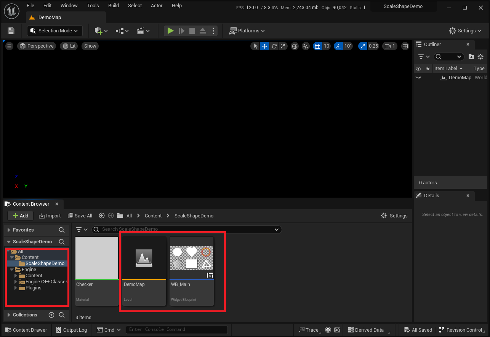

# Scale Shape Demos

## Usage

* First, select the zip package corresponding to your engine version [(UE5.1)](ue5.1.zip) [(UE5.2)](ue5.2.zip), download it, and extract the files.

* Open it in Unreal Editor, click on "Play" (ALT+P), and the map will display various widgets of Scale Shape. You can find the UserWidget: WB_Main next to the DemoMap.

    